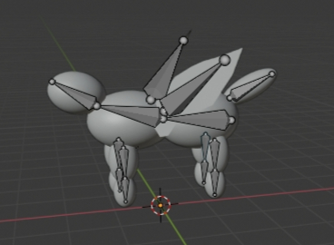

# Opengl_FinalProject

E94051160 陳柏志 資訊109

## 作業環境

Ubuntu18.04/Linux

* install:
sudo apt-get install libglfw3-dev libglfw3 //安裝glfw
sudo apt-get install libglew-dev //安裝glew
sudo apt-get install libglm-dev //安裝glm
sudo apt-get install freeglut3-dev //透過安裝freeglut安裝opengl
pkg-config --libs --static glew
pkg-config --libs --static glfw3

sudo apt-get install libassimp-dev
sudo apt-get install assimp-utils

## 模型骨架



## 方法說明

1. 實做光照效果
    * 在物體的shader中實做出各種光照效果（環境光，漫反射光照，鏡面光照）
    * 分別實做Phong以及Blinn Phong，兩種差別在於計算specular時，Phong的光線使用reflect，光會根據法向量做固定方向的反射；而Blinn Phong則是使用Halfway vector做反射
2. 點光源
    * 使用陣列宣告一個正方體方塊
    * 使用令一套shader(light_cube)實做一個會旋轉的正方體點光源
    * 點光源的位置會根據時間做變化（繞著物體旋轉）

## 編譯

```
g++ -std=c++0x -o output main.cpp -lGL -lglfw -lGLEW -lm -lassimp
```

## 執行

```
./ouptut
```

### 操作說明

攝影機：
1. 使用按鍵WASD上下左右移動攝影機
2. 使用滑鼠滾輪縮放視野

模型操作：
1. 按住滑鼠左鍵並移動來旋轉model
2. ```按鍵SPACE（空白鍵）``` 執行跑步動作，再按一次停止
3. ```按鍵ENTER``` 切換 Phong / Blinn Phong 光照形式

關節操作(使用按鍵）：
* 頭部
```按鍵1``` 往左
```按鍵2``` 往右
```按鍵3``` 往上
```按鍵4``` 往下
* 身體
```按鍵5``` 往左
```按鍵6``` 往右
```按鍵7``` 往上
```按鍵8``` 往下
* 左前腳（下肢）
```按鍵R``` 往前
```按鍵F``` 往後
* 左前腳（上肢）
```按鍵T``` 往前
```按鍵G``` 往後
* 右前腳（上肢）
```按鍵Y``` 往前
```按鍵H``` 往後
* 右前腳（下肢）
```按鍵U``` 往前
```按鍵J``` 往後
* 左後腳（下肢）
```按鍵I``` 往前
```按鍵K``` 往後
* 左後腳（上肢）
```按鍵O``` 往前
```按鍵L``` 往後
* 右後腳（上肢）
```按鍵P``` 往前
```按鍵;``` 往後
* 右後腳（下肢）
```按鍵[``` 往前
```按鍵'``` 往後
* 尾巴
```按鍵Z``` 往左
```按鍵X``` 往右
```按鍵C``` 往上
```按鍵V``` 往下
* 翅膀
```按鍵B``` 左翅往上
```按鍵N``` 左翅往下
```按鍵M``` 右翅往下
```按鍵,``` 右翅往上

```按鍵ESC``` 退出程式